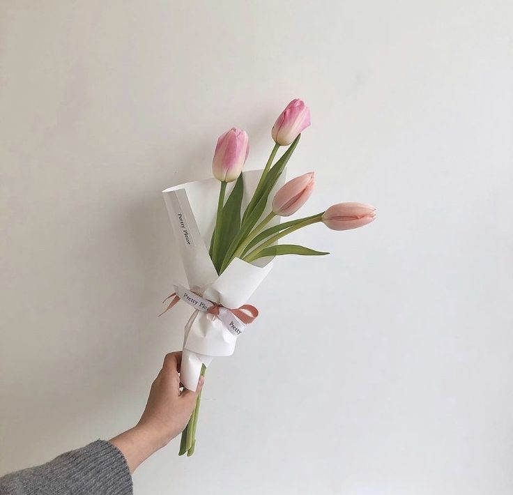

<html>
<head>
    <title>WEB Perpustakaan </title>
    <link rel="stylesheet" href="syn.css" />
</head>
<body>
    

    <!-- NAVIGATION BAR -->
    

        <ul class="ul-navbar">
            <li class="li-navbar">
                <a href="#" class="a-navbar">BERANDA</a>
            </li>
            <li class="li-navbar">
                <a href="katalog.html" class="a-navbar">KATALOG</a>
            </li>
            <li class="li-navbar">
               <a href="pesan.php" class="a-navbar">PEMESANAN</a> 
            </li>
            <li class="li-navbar">
               <a href="contact.html" class="a-navbar">KONTAK</a> 
            </li>
        </ul>
    

    <!-- NAVIGATION BAR SELESAI -->

    <!-- CONTENT 1 -->
    

        
    

    <!-- CONTENT END -->

    <!-- FOOTER -->
    

        <h1 class="h1-footer">Toko Penjualan Bucket Bunga</h1>
        <h2 class="h2-footer">Pemesanan bucket dapat dilihat di KATALOG</h2>
        <h3 class="h3-footer">pemesanan dilakukan dengan mengisi data diri dibagian PEMESANAN</h3>
    

        
&copy; 2023 oleh synthia 

    <!-- FOOTER END -->
    

</body>
</html>  
